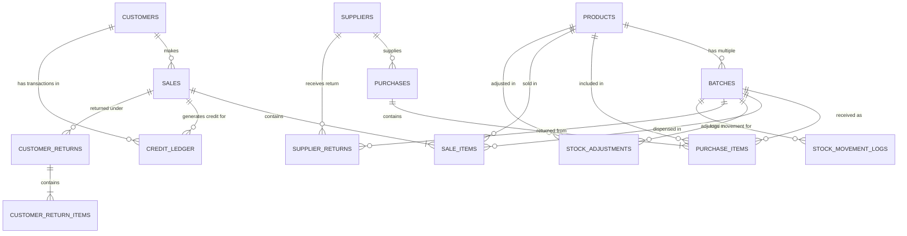

# 08 — Database Design & Schema Specification

**Document status:** Finalized v1.0 — Complete Relational Data Specification  
**Target RDBMS:** PostgreSQL 15+  
**ORM:** SQLAlchemy 2.0  
**Migrations:** Alembic  
**Related documents:** `01-project-overview.md`, `02-client-requirements.md`, `03-functional-requirements.md`, `05-business-rules.md`, `07-system-architecture.md`

---

## 1. Design Philosophy & Data Integrity

PharmaKon uses **PostgreSQL** as the single operational source of truth. The database design is strictly normalized (3NF), relationship-heavy, and enforced by database-level constraints.

### Core Database Principles
1. **Strict Relational Integrity:** All entity relationships enforce foreign key constraints with appropriate deletion cascading behaviors (predominantly `RESTRICT` to preserve historical audits).
2. **Negative Inventory Prevention:** Enforced at the database layer via `CHECK (quantity >= 0)`.
3. **Historical Data Preservation:** Completed transactions (sales, purchases, returns, adjustments) are never mutated or hard-deleted. Soft deletes (`is_active = FALSE`) are used for reference data like products and suppliers.
4. **Batch-Level Profit Tracking:** `purchase_cost` is locked onto each `batches` and `purchase_items` row. `actual_selling_rate` is locked onto each `sale_items` row.
5. **Auditable Stock Ledger:** `stock_movement_logs` records every inventory delta with a timestamp and transactional reference ID.

---

## 2. Entity Relationship Diagram (ERD)



---

## 3. Comprehensive Table Specifications

### 3.1 `products`
Main catalog of medicines and retail items (~1,500 products).

| Column Name | Data Type | Constraints | Description |
| :--- | :--- | :--- | :--- |
| `id` | `UUID` | `PRIMARY KEY`, Default: `gen_random_uuid()` | Unique product identifier |
| `code` | `VARCHAR(50)` | `NOT NULL`, `UNIQUE` | Unique SKU/product code |
| `name` | `VARCHAR(255)` | `NOT NULL`, `INDEX` | Commercial product name |
| `category` | `VARCHAR(50)` | `NOT NULL`, `INDEX` | Category (*Medicine, Surgical, Cosmetic, Baby, Food*) |
| `unit` | `VARCHAR(20)` | `NOT NULL` | Base unit (*Strip, Tablet, Bottle, Box, Piece*) |
| `mrp` | `NUMERIC(10,2)` | `NOT NULL`, `CHECK (mrp >= 0)` | Maximum Retail Price ceiling in NPR |
| `default_purchase_price`| `NUMERIC(10,2)` | `NULLABLE`, `CHECK (default_purchase_price >= 0)` | Default reference purchase cost |
| `barcode` | `VARCHAR(100)` | `NULLABLE`, `INDEX` | Barcode string (EAN/UPC) |
| `reorder_level` | `INTEGER` | `NOT NULL`, Default: `10`, `CHECK (reorder_level >= 0)` | Stock threshold for low-stock alerts |
| `is_active` | `BOOLEAN` | `NOT NULL`, Default: `TRUE` | Soft deletion status |
| `created_at` | `TIMESTAMPTZ` | `NOT NULL`, Default: `NOW()` | Record creation timestamp |
| `updated_at` | `TIMESTAMPTZ` | `NOT NULL`, Default: `NOW()` | Record update timestamp |

---

### 3.2 `suppliers`
Vendor records for medicine wholesalers and distributors.

| Column Name | Data Type | Constraints | Description |
| :--- | :--- | :--- | :--- |
| `id` | `UUID` | `PRIMARY KEY` | Unique supplier ID |
| `name` | `VARCHAR(255)` | `NOT NULL`, `INDEX` | Supplier company name |
| `contact_person` | `VARCHAR(100)` | `NULLABLE` | Primary sales contact name |
| `phone` | `VARCHAR(20)` | `NOT NULL` | Phone number |
| `email` | `VARCHAR(100)` | `NULLABLE` | Email address |
| `address` | `TEXT` | `NULLABLE` | Physical address |
| `pan_vat_number` | `VARCHAR(50)` | `NULLABLE` | Tax identification number |
| `is_active` | `BOOLEAN` | `NOT NULL`, Default: `TRUE` | Active status |
| `created_at` | `TIMESTAMPTZ` | `NOT NULL`, Default: `NOW()` | Creation timestamp |
| `updated_at` | `TIMESTAMPTZ` | `NOT NULL`, Default: `NOW()` | Update timestamp |

---

### 3.3 `batches`
Inventory lots of products with distinct expiry dates and purchase costs.

| Column Name | Data Type | Constraints | Description |
| :--- | :--- | :--- | :--- |
| `id` | `UUID` | `PRIMARY KEY` | Unique batch ID |
| `product_id` | `UUID` | `NOT NULL`, `FOREIGN KEY (products.id)` | Associated product |
| `batch_number` | `VARCHAR(100)` | `NOT NULL` | Manufacturer/Supplier batch number |
| `expiry_date` | `DATE` | `NOT NULL`, `INDEX` | Expiry date (critical for FEFO) |
| `purchase_cost` | `NUMERIC(10,2)` | `NOT NULL`, `CHECK (purchase_cost >= 0)` | Unit cost for this batch |
| `quantity` | `INTEGER` | `NOT NULL`, `CHECK (quantity >= 0)` | Available physical stock (In-Stock) |
| `is_active` | `BOOLEAN` | `NOT NULL`, Default: `TRUE` | Active status |
| `created_at` | `TIMESTAMPTZ` | `NOT NULL`, Default: `NOW()` | Creation timestamp |
| `updated_at` | `TIMESTAMPTZ` | `NOT NULL`, Default: `NOW()` | Update timestamp |

> **Unique Constraint:** `UNIQUE(product_id, batch_number, expiry_date)` prevents duplicate batch records.

---

### 3.4 `purchases`
Header details for stock purchases from suppliers.

| Column Name | Data Type | Constraints | Description |
| :--- | :--- | :--- | :--- |
| `id` | `UUID` | `PRIMARY KEY` | Unique purchase transaction ID |
| `supplier_id` | `UUID` | `NOT NULL`, `FOREIGN KEY (suppliers.id)` | Supplier |
| `invoice_reference` | `VARCHAR(100)` | `NOT NULL` | Supplier's bill/invoice number |
| `voucher_date` | `DATE` | `NOT NULL` | Purchase invoice date |
| `total_amount` | `NUMERIC(12,2)` | `NOT NULL`, `CHECK (total_amount >= 0)` | Grand total cost |
| `payment_status` | `VARCHAR(20)` | `NOT NULL` | `PAID`, `UNPAID`, `PARTIAL` |
| `notes` | `TEXT` | `NULLABLE` | Internal notes |
| `created_at` | `TIMESTAMPTZ` | `NOT NULL`, Default: `NOW()` | System entry timestamp |

---

### 3.5 `purchase_items`
Line items for purchase bills.

| Column Name | Data Type | Constraints | Description |
| :--- | :--- | :--- | :--- |
| `id` | `UUID` | `PRIMARY KEY` | Unique purchase item ID |
| `purchase_id` | `UUID` | `NOT NULL`, `FOREIGN KEY (purchases.id)` | Parent purchase bill |
| `product_id` | `UUID` | `NOT NULL`, `FOREIGN KEY (products.id)` | Purchased product |
| `batch_id` | `UUID` | `NOT NULL`, `FOREIGN KEY (batches.id)` | Destination batch |
| `quantity` | `INTEGER` | `NOT NULL`, `CHECK (quantity > 0)` | Purchased quantity |
| `unit_purchase_cost`| `NUMERIC(10,2)` | `NOT NULL`, `CHECK (unit_purchase_cost >= 0)`| Cost per unit |
| `subtotal` | `NUMERIC(12,2)` | `NOT NULL`, `CHECK (subtotal >= 0)` | Total line cost |

---

### 3.6 `customers`
Profiles for retail and credit customers.

| Column Name | Data Type | Constraints | Description |
| :--- | :--- | :--- | :--- |
| `id` | `UUID` | `PRIMARY KEY` | Unique customer ID |
| `name` | `VARCHAR(255)` | `NOT NULL`, `INDEX` | Customer full name |
| `phone` | `VARCHAR(20)` | `NOT NULL`, `INDEX` | Primary phone/WhatsApp number |
| `address` | `TEXT` | `NULLABLE` | Physical address |
| `pan_vat_number` | `VARCHAR(50)` | `NULLABLE` | Customer tax identifier |
| `created_at` | `TIMESTAMPTZ` | `NOT NULL`, Default: `NOW()` | Creation timestamp |
| `updated_at` | `TIMESTAMPTZ` | `NOT NULL`, Default: `NOW()` | Update timestamp |

---

### 3.7 `sales`
Header records for sales invoices.

| Column Name | Data Type | Constraints | Description |
| :--- | :--- | :--- | :--- |
| `id` | `UUID` | `PRIMARY KEY` | Unique sale ID |
| `invoice_number` | `VARCHAR(50)` | `NOT NULL`, `UNIQUE` | Generated invoice ID (e.g. `INV-2026-0001`) |
| `fiscal_year` | `VARCHAR(10)` | `NOT NULL` | Nepali Fiscal Year (e.g. `2083/84`) |
| `customer_id` | `UUID` | `NULLABLE`, `FOREIGN KEY (customers.id)` | Customer (optional for walk-in cash) |
| `voucher_date` | `TIMESTAMPTZ` | `NOT NULL`, Default: `NOW()` | Billing timestamp |
| `subtotal` | `NUMERIC(12,2)` | `NOT NULL`, `CHECK (subtotal >= 0)` | Sum of line totals before tax/discount |
| `discount_amount` | `NUMERIC(12,2)` | `NOT NULL`, Default: `0.00` | Discount subtracted |
| `tax_amount` | `NUMERIC(12,2)` | `NOT NULL`, Default: `0.00` | 13% VAT added |
| `round_off` | `NUMERIC(5,2)` | `NOT NULL`, Default: `0.00` | Rounding adjustment |
| `grand_total` | `NUMERIC(12,2)` | `NOT NULL`, `CHECK (grand_total >= 0)`| Final payable amount |
| `payment_method` | `VARCHAR(20)` | `NOT NULL` | `CASH`, `ESEWA`, `BANK`, `CREDIT` |
| `payment_status` | `VARCHAR(20)` | `NOT NULL` | `PAID`, `UNPAID`, `PARTIAL` |
| `is_credit` | `BOOLEAN` | `NOT NULL`, Default: `FALSE` | Credit transaction flag |
| `created_at` | `TIMESTAMPTZ` | `NOT NULL`, Default: `NOW()` | Transaction creation timestamp |

---

### 3.8 `sale_items`
Individual line items contained in a sales invoice.

| Column Name | Data Type | Constraints | Description |
| :--- | :--- | :--- | :--- |
| `id` | `UUID` | `PRIMARY KEY` | Unique sale line item ID |
| `sale_id` | `UUID` | `NOT NULL`, `FOREIGN KEY (sales.id)` | Parent sale invoice |
| `product_id` | `UUID` | `NOT NULL`, `FOREIGN KEY (products.id)` | Sold product |
| `batch_id` | `UUID` | `NOT NULL`, `FOREIGN KEY (batches.id)` | Dispensed batch (selected via FEFO) |
| `quantity` | `INTEGER` | `NOT NULL`, `CHECK (quantity > 0)` | Quantity sold |
| `mrp` | `NUMERIC(10,2)` | `NOT NULL` | Reference MRP at sale time |
| `actual_selling_rate`|`NUMERIC(10,2)` | `NOT NULL`, `CHECK (actual_selling_rate >= 0)`| Custom/Actual rate charged per unit |
| `purchase_cost` | `NUMERIC(10,2)` | `NOT NULL` | Locked unit purchase cost for profit analysis |
| `discount_rate` | `NUMERIC(5,2)` | `NOT NULL`, Default: `0.00` | Line discount % |
| `tax_rate` | `NUMERIC(5,2)` | `NOT NULL`, Default: `13.00` | Line tax % |
| `subtotal` | `NUMERIC(12,2)` | `NOT NULL`, `CHECK (subtotal >= 0)` | Line total |

---

### 3.9 `credit_ledger`
Digital ledger tracking credit sales and subsequent customer payments.

| Column Name | Data Type | Constraints | Description |
| :--- | :--- | :--- | :--- |
| `id` | `UUID` | `PRIMARY KEY` | Unique ledger entry ID |
| `customer_id` | `UUID` | `NOT NULL`, `FOREIGN KEY (customers.id)` | Customer |
| `sale_id` | `UUID` | `NULLABLE`, `FOREIGN KEY (sales.id)` | Associated credit sale invoice (if applicable) |
| `transaction_type`| `VARCHAR(20)` | `NOT NULL` | `CREDIT_SALE`, `PAYMENT_RECEIVED` |
| `amount` | `NUMERIC(12,2)` | `NOT NULL` | Transaction amount |
| `outstanding_balance`|`NUMERIC(12,2)`| `NOT NULL`, `CHECK (outstanding_balance >= 0)`| Running customer balance after entry |
| `payment_method` | `VARCHAR(20)` | `NULLABLE` | `CASH`, `ESEWA`, `BANK` (for payments) |
| `notes` | `TEXT` | `NULLABLE` | Transaction remarks |
| `transaction_date`| `TIMESTAMPTZ` | `NOT NULL`, Default: `NOW()` | Date of entry |

---

### 3.10 `stock_adjustments`
Audit log of stock modifications resulting from physical stock verification.

| Column Name | Data Type | Constraints | Description |
| :--- | :--- | :--- | :--- |
| `id` | `UUID` | `PRIMARY KEY` | Unique adjustment ID |
| `product_id` | `UUID` | `NOT NULL`, `FOREIGN KEY (products.id)` | Adjusted product |
| `batch_id` | `UUID` | `NOT NULL`, `FOREIGN KEY (batches.id)` | Adjusted batch |
| `previous_quantity`| `INTEGER` | `NOT NULL` | Quantity prior to count |
| `new_quantity` | `INTEGER` | `NOT NULL`, `CHECK (new_quantity >= 0)` | Physical count quantity |
| `adjustment_quantity`|`INTEGER` | `NOT NULL` | Delta (`new_quantity - previous_quantity`) |
| `reason` | `VARCHAR(50)` | `NOT NULL` | `PHYSICAL_COUNT`, `DAMAGED`, `EXPIRED`, `CORRECTION` |
| `notes` | `TEXT` | `NULLABLE` | Verification details |
| `adjusted_at` | `TIMESTAMPTZ` | `NOT NULL`, Default: `NOW()` | Adjustment timestamp |

---

### 3.11 `supplier_returns`
Record of non-saleable (damaged/expired) stock returned to vendors.

| Column Name | Data Type | Constraints | Description |
| :--- | :--- | :--- | :--- |
| `id` | `UUID` | `PRIMARY KEY` | Unique return record ID |
| `supplier_id` | `UUID` | `NOT NULL`, `FOREIGN KEY (suppliers.id)` | Destination supplier |
| `product_id` | `UUID` | `NOT NULL`, `FOREIGN KEY (products.id)` | Product |
| `batch_id` | `UUID` | `NOT NULL`, `FOREIGN KEY (batches.id)` | Returned batch |
| `quantity` | `INTEGER` | `NOT NULL`, `CHECK (quantity > 0)` | Quantity returned |
| `unit_cost` | `NUMERIC(10,2)` | `NOT NULL` | Unit purchase cost |
| `total_refund_amount`|`NUMERIC(12,2)`| `NOT NULL` | Total credit note/refund value |
| `reason` | `VARCHAR(50)` | `NOT NULL` | `EXPIRED`, `DAMAGED` |
| `status` | `VARCHAR(20)` | `NOT NULL`, Default: `'COMPLETED'` | `PENDING`, `COMPLETED` |
| `created_at` | `TIMESTAMPTZ` | `NOT NULL`, Default: `NOW()` | Entry timestamp |

---

### 3.12 `customer_returns` & `customer_return_items`
Header and line records for processed customer refunds.

#### `customer_returns`
| Column Name | Data Type | Constraints | Description |
| :--- | :--- | :--- | :--- |
| `id` | `UUID` | `PRIMARY KEY` | Return ID |
| `sale_id` | `UUID` | `NOT NULL`, `FOREIGN KEY (sales.id)` | Original sales invoice |
| `customer_id` | `UUID` | `NULLABLE`, `FOREIGN KEY (customers.id)` | Customer |
| `return_number` | `VARCHAR(50)` | `NOT NULL`, `UNIQUE` | Return credit note number |
| `total_refund_amount`|`NUMERIC(12,2)`| `NOT NULL` | Amount refunded |
| `return_date` | `TIMESTAMPTZ` | `NOT NULL`, Default: `NOW()` | Date of return |

#### `customer_return_items`
| Column Name | Data Type | Constraints | Description |
| :--- | :--- | :--- | :--- |
| `id` | `UUID` | `PRIMARY KEY` | Item ID |
| `customer_return_id`|`UUID` | `NOT NULL`, `FOREIGN KEY (customer_returns.id)` | Parent return |
| `sale_item_id` | `UUID` | `NOT NULL`, `FOREIGN KEY (sale_items.id)` | Original sale line |
| `product_id` | `UUID` | `NOT NULL`, `FOREIGN KEY (products.id)` | Product |
| `batch_id` | `UUID` | `NOT NULL`, `FOREIGN KEY (batches.id)` | Batch |
| `quantity` | `INTEGER` | `NOT NULL`, `CHECK (quantity > 0)` | Returned quantity |
| `refund_rate` | `NUMERIC(10,2)` | `NOT NULL` | Rate per item refunded |
| `condition` | `VARCHAR(30)` | `NOT NULL` | `RESTOCKABLE`, `DAMAGED`, `EXPIRED` |

---

### 3.13 `stock_movement_logs`
Unified immutable ledger for all stock fluctuations across the application.

| Column Name | Data Type | Constraints | Description |
| :--- | :--- | :--- | :--- |
| `id` | `UUID` | `PRIMARY KEY` | Log entry ID |
| `product_id` | `UUID` | `NOT NULL`, `FOREIGN KEY (products.id)` | Product |
| `batch_id` | `UUID` | `NOT NULL`, `FOREIGN KEY (batches.id)` | Batch |
| `movement_type` | `VARCHAR(30)` | `NOT NULL` | `PURCHASE`, `SALE`, `CUSTOMER_RETURN`, `SUPPLIER_RETURN`, `ADJUSTMENT` |
| `quantity_delta` | `INTEGER` | `NOT NULL` | Signed integer delta (+ for add, - for deduct) |
| `resulting_quantity`|`INTEGER` | `NOT NULL` | Stock level after delta applied |
| `reference_id` | `UUID` | `NOT NULL` | Foreign key ID of transaction header |
| `created_at` | `TIMESTAMPTZ` | `NOT NULL`, Default: `NOW()`, `INDEX` | Audit timestamp |

---

## 4. Indexing & Optimization Strategy

To maintain sub-second queries on retail hardware for POS search and analytics aggregations:

```sql
-- POS Fast Product Search Indexes
CREATE INDEX idx_products_code ON products(code);
CREATE INDEX idx_products_barcode ON products(barcode) WHERE barcode IS NOT NULL;
CREATE INDEX idx_products_name_trgm ON products USING gin (name gin_trgm_ops);

-- FEFO Batch Selection Index (Critical for fast POS response)
CREATE INDEX idx_batches_fefo ON batches(product_id, expiry_date ASC) WHERE quantity > 0 AND is_active = TRUE;

-- Sales & Purchases Analytical Indexes
CREATE INDEX idx_sales_voucher_date ON sales(voucher_date);
CREATE INDEX idx_sales_invoice_number ON sales(invoice_number);
CREATE INDEX idx_sale_items_product_batch ON sale_items(product_id, batch_id);
CREATE INDEX idx_stock_movement_logs_audit ON stock_movement_logs(product_id, batch_id, created_at DESC);
CREATE INDEX idx_credit_ledger_customer ON credit_ledger(customer_id, transaction_date DESC);
```

---

## 5. Migration Strategy

Schema changes will be strictly version-controlled using **Alembic**.
- Migration scripts stored in `backend/alembic/versions/`.
- Every migration must include explicit `upgrade()` and `downgrade()` methods.
- Seed data scripts provided in `backend/seeds/` for initial category definitions and demo retail catalog.
